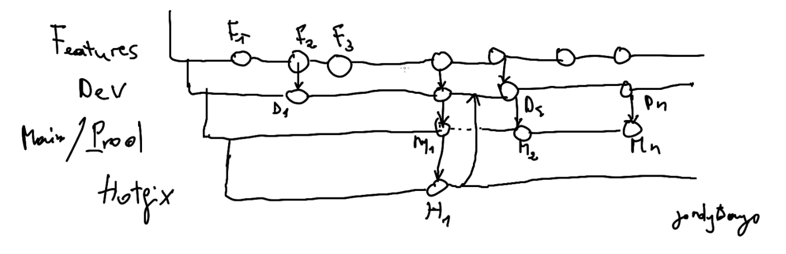

# Code Policy
> Always choose simple code than complex 

>Any Code follows TDD (Test Driven Design) 

>Modularity is always preffered

>Any repository should have a test directory for unit testing code.  

# Build Automation
> Compiled  

> Transormed

> Unit Tests  

> Scan the code for problems  

> Report Problems  

> Eliminstate Defects 

# Continius Integration
> Frequently merging the code changes

> CI Tools:  ✔ Github Action, Jenkins, Gitlab CI , Circle CI

# Continius Deployment
> Source Code with Git 

> Github 

> 👷 Build 

> ❓QA  

> ⚠⚠⚠ Report Problems  

> 🚧 Eliminstate Defects  

# Continius Delivery
> Code

> Build

> Tests  (QA, Stage) : Now need a business decision to push code in production 👇

> Release : The result of all what is behind is called a package 📦 That is ready to be deploy 👇

> Deploy

> Operate 

# CI/CD Policy
> We use github workflows 

> Any code repository should contain a **.github** directory with all the workflows needed to test all the repo

> Push to major branch like *DEV* and *Main* should be made every **FRIDAY 4PM**

# IaC Infrastructure as Code
> Managing and provisionning infrastructure using Code

> Use Code to deploy infrastructure of any size

> Provision new ressources / modify existing ressource - using Code

> Deployment consistense (ensure every config is deploy the same way)

> Sef Documenting (see how differents version where deployed to identified what change)

> Replicate environments to Test, QA and Prod 

# Configuration Management
> Doing the changes in a maintanable way

> Minimizing the configuration drift

> Controlling the configuration/deployment

> Configuration management keep all servers at consistent state

> Identify the state of infrastructure

> Replicate environments to Test, QA and Prod 

> Tools:
 1. ✔ Ansible 

# git/github  
1. Branching strategies 
   
   > **Feature:** This branch is for implementing features and it can contains sub-features directories

   > **Development:** This branch is for a set of features already validated, and should be tagged with different version

   > **Main:** This branch contains exactly the same code with the one production and is protected nobody should push there 

   > **HotFix:** This branch contains only hot changement , when something is in production and we did an error, we should then merge the correction of HotFix in DEV branch and in Main Branch 
2. Pull Request 
   > All ToDo should be *github issues*
   
   > Any good code upgrade that can be done and that is not done yet shoul be pull request

# Microservices
> What ca be advantages : 
 1. Quickly respond to problems
 2. Collect System Metrics

> Virtualization and Containerization
 1. Docker

# Monitoring
> What can be advantages : 
 1. Quickly respond to problems
 2. Collect System Metrics
 3. Represent data in a presentable manner
 4. Real time monitoring and notifications
 5. Assist in troubleshooting

> Infrastructure Monitoring Tools
 1. Sensu 
 2. Nagios
 3. New Relic
 4. ✔ Elastic Stack (ELK)

> Application Performance Monitoring Tools
 1. APPDYNAMICS
 2. New Relic
 3. ✔ Elastic Stack (ELK)

# Orchestration 
> What can be advantages : 
 1. AutoScale Applications based on usage
 2. Create self healing systems

> Tools
 1. Docker swarm 
 2. ✔ Kubernetes
 3. ZooKeeper
 4. Terraform

# Tasks / Sprints
> A sprint last **one Week**

> A Detailed Planning is available on the __planning.excel__ file, and it contains exactly for each week what the print ToDo

> 