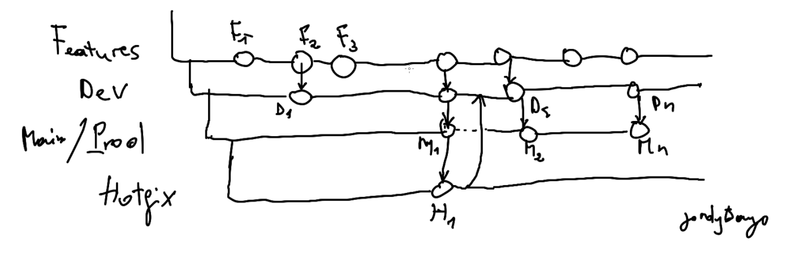

# Code Policy
> Always choose simple code than complex 

>Any Code follows TDD (Test Driven Design) 

>Modularity is always preffered

>Any repository should have a test directory for unit testing code.  

# CI/CD Policy
> We use github workflows 

> Any code repository should contain a **.github** directory with all the workflows needed to test all the repo

> Push to major branch like *DEV* and *Main* should be made every **FRIDAY 4PM**

# Code Monitoring
> We use github workflows

> Any code repository should contain a **.github** directory with all the workflows needed to test all the repo  

# git/github  
1. Branching strategies 
   
   > **Feature:** This branch is for implementing features and it can contains sub-features directories

   > **Development:** This branch is for a set of features already validated, and should be tagged with different version

   > **Main:** This branch contains exactly the same code with the one production and is protected nobody should push there 

   > **HotFix:** This branch contains only hot changement , when something is in production and we did an error, we should then merge the correction of HotFix in DEV branch and in Main Branch 
2. Pull Request 
   > All ToDo should be *github issues*
   
   > Any good code upgrade that can be done and that is not done yet shoul be pull request

# Tasks / Sprints
> A sprint last **one Week**

> A Detailed Planning is available on the __planning.excel__ file, and it contains exactly for each week what the print ToDo

> 